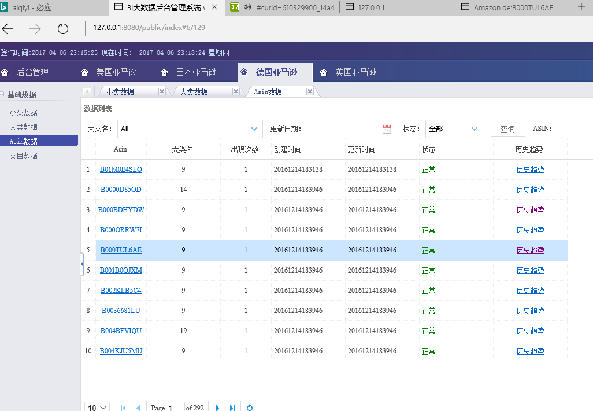

亚马逊大爬虫可视化界面Web端

此Web框架已经优化，改BUG，定制成为脚手架，见[https://www.github.com/hunterhug/GoWeb](https://www.github.com/hunterhug/GoWeb)

# 文件目录
```
----conf 配置文件夹

	----app.conf 		应用配置文件
	----local_**.ini 	国际化文件

----controllers 控制器
	----admin	后台控制器
		----blog 博客模块
		----rbac 权限模块
	----home 	前台控制器

-----lib 公共库
-----file 上传文件保存地址
-----models ORM模型
	----admin RBAC主要数据库
	----blog 博客主要数据库
	----home 

----routers 路由
----static  静态文件
----views	视图
	----admin 	后台视图
		----default 默认主题
	----home 	前台视图
		----default 默认主题

----log 日志
----doc 说明文档
----test 测试文件夹
```

# 运行步骤
1.运行init.sh进行包初始化或者根据提示go install，某些包有防火长城

2.接着获取代码

```
    go get -u -v github.com/hunterhug/AmazonBigSpiderWeb
    或者
	git clone https://www.github.com/hunterhug/AmazonBigSpiderWeb
```

3.初始化数据库

```
go build main.go 
./main -s
```

4.运行

```
go build main.go
./main
或者
go run main.go
或者
bee run
```

打开浏览器：
127.0.0.1：8080即可登录，账号密码为admin，admin




5.nginx配置 nginx.conf

```
server{
        listen 80;
        server_name bi.lenggirl.com bi.smartdo.xin;
        charset utf-8;
        access_log /data/logs/nginx/beauty.lenggirl.com.log;
        #error_log /data/logs/nginx/www.lenggirl.com.err;
        location / {
        proxy_set_header X-Forwarded-For $proxy_add_x_forwarded_for;
        proxy_set_header Host $http_host;
        proxy_redirect off;
        proxy_pass http://localhost:8080;
        proxy_set_header X-Real-Ip $remote_addr;
        }
}

```

server_name和proxy_pass需要改

6.填写配置文件conf/app.conf

```
appname = beauty
version = 1.0.0

# 生产环境改为prod
runmode = dev

###################

# 可以直接通过静态访问的文件夹，位于根目录下面
StaticDir = static:static file:file

# 国际化语言
lang_types = en-US|zh-CN

# 路由区分大小写
RouterCaseSensitive = false

# 中国时间请设为8，不然数据库时间会混乱
timezone = 8

# 调试数据库 close/open
dblog = close

###################

# 前台模板，可以改,wordpress功能
home_template = home/beauty
admin_template = admin/default

# 智干模板
smart_temlate = smart/default

# 文件上传保存地址，后面不可以是/，必须是根目录下的文件夹，为了速度更快，文件直接到前端，可改写
filebasepath = file

###################

# 权限控制，建议不要乱改
sessionon = true
sessionname = beautysessionid
sessionhashkey = mostbeautyart
rbac_role_table = role
rbac_node_table = node
rbac_group_table = group
rbac_user_table = user
rbac_admin_user = admin
not_auth_package = public,static,home,file

###################

# 0不验证，1验证，2实时验证,建议不要改
user_auth_type = 2
rbac_auth_gateway = /public/login

# cookie一周内登录开关，1表示开，建议设为0
cookie7 = 1

[dev]
httpport = 8080
db_host = 127.0.0.1
db_port = 3306
db_user = root
db_pass = smart2016
db_name = beauty
db_type = mysql
db_prefix = tb_
usadatadb = root:smart2016@tcp(127.0.0.1:3306)/smartdb?charset=utf8
usabasicdb = root:smart2016@tcp(127.0.0.1:3306)/smart_base?charset=utf8
usahashdb = root:smart2016@tcp(127.0.0.1:3306)/smart_hash?charset=utf8
jpdatadb = root:smart2016@tcp(127.0.0.1:3306)/jp_smartdb?charset=utf8
jpbasicdb = root:smart2016@tcp(127.0.0.1:3306)/jp_smart_base?charset=utf8
jphashdb = root:smart2016@tcp(127.0.0.1:3306)/jp_smart_hash?charset=utf8
dedatadb = root:smart2016@tcp(127.0.0.1:3306)/de_smartdb?charset=utf8
debasicdb = root:smart2016@tcp(127.0.0.1:3306)/de_smart_base?charset=utf8
dehashdb = root:smart2016@tcp(127.0.0.1:3306)/de_smart_hash?charset=utf8
ukdatadb = root:smart2016@tcp(127.0.0.1:3306)/uk_smartdb?charset=utf8
ukbasicdb = root:smart2016@tcp(127.0.0.1:3306)/uk_smart_base?charset=utf8
ukhashdb = root:smart2016@tcp(127.0.0.1:3306)/uk_smart_hash?charset=utf8
dbback = root:smart2016@tcp(127.0.0.1:3306)/smart_backstage?charset=utf8

[prod]
EnableGzip = true
httpport = 80
db_host = 127.0.0.1
db_port = 3306
db_user = root
db_pass = smart2016
db_name = beauty
db_type = mysql
db_prefix = tb_
usadatadb = root:smart2016@tcp(127.0.0.1:3306)/smartdb?charset=utf8
usabasicdb = root:smart2016@tcp(127.0.0.1:3306)/smart_base?charset=utf8
usahashdb = root:smart2016@tcp(127.0.0.1:3306)/smart_hash?charset=utf8
jpdatadb = root:smart2016@tcp(127.0.0.1:3306)/jp_smartdb?charset=utf8
jpbasicdb = root:smart2016@tcp(127.0.0.1:3306)/jp_smart_base?charset=utf8
jphashdb = root:smart2016@tcp(127.0.0.1:3306)/jp_smart_hash?charset=utf8
dedatadb = root:smart2016@tcp(127.0.0.1:3306)/de_smartdb?charset=utf8
debasicdb = root:smart2016@tcp(127.0.0.1:3306)/de_smart_base?charset=utf8
dehashdb = root:smart2016@tcp(127.0.0.1:3306)/de_smart_hash?charset=utf8
ukdatadb = root:smart2016@tcp(127.0.0.1:3306)/uk_smartdb?charset=utf8
ukbasicdb = root:smart2016@tcp(127.0.0.1:3306)/uk_smart_base?charset=utf8
ukhashdb = root:smart2016@tcp(127.0.0.1:3306)/uk_smart_hash?charset=utf8
dbback = root:smart2016@tcp(127.0.0.1:3306)/smart_backstage?charset=utf8
```

# 项目约定
>RBAC权限相关的models统一放在admin文件夹，其他都放在home文件夹.
	前台控制相关的controllers统一放在home文件夹，其他都放在admin文件夹
	URL router统一M/C/A方式，该正则url需要验证权限，如rbac/public/index，其他如public/index不验证。

>登录说明
	登陆过的用户只能注销后登录，支持定义cookie登录。进入后台时验证session，session不存在则验证cookie，如果用户未被冻结，增加session，
	同时更改用户登录时间、登录IP等，cookie与登录IP绑定。

>系统时间默认数据库本地时间为东八区，北京时间。

>后台模板在views/admin，前台模板在views/home，子文件夹为主题，默认主题为default

>所有配置在conf文件夹conf/app.conf，支持国际化

>数据库数据填充在models/*/*Init.go中定义

>视图模板均放在static中
